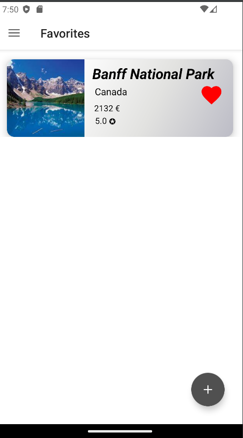

# Travel Journal (Final Project) - Google Atelierul Digital pentru Programatori

This repository contains the final project of the "Android Fundamentals" course offered by the Google Developer's Workshop. The project is called "Travel Journal" and was completed during the tenth week of the course.

The purpose of this project was to showcase the knowledge and skills acquired throughout the Android Fundamentals course. The Travel Journal is a mobile application that allows users to record and manage their travel experiences and memories.

Key features of the project include:

- Recording destinations and travel details in Room database.
- Adding photos and descriptions for each visited destination.
- Viewing and editing previously recorded details.
- Ability to share travel experiences on social media.
- Delete a trip.
- Adding a trip at favorites.

# Used technologies:

- Room
- Picasso
- OpenWeatherMap API

 

  

   

